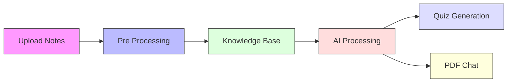
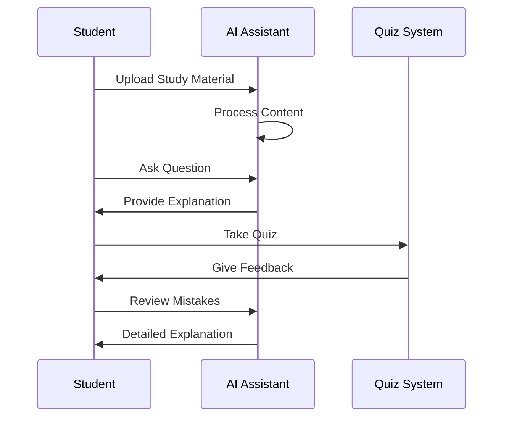
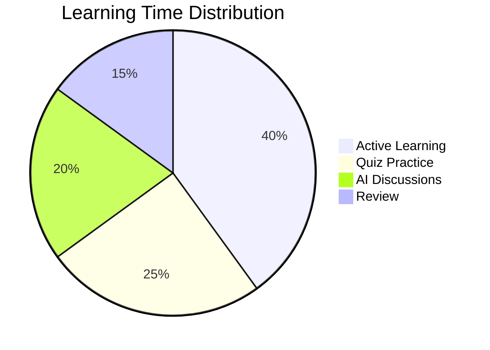
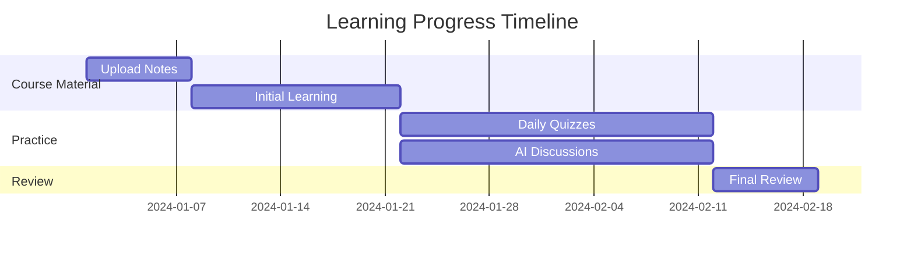
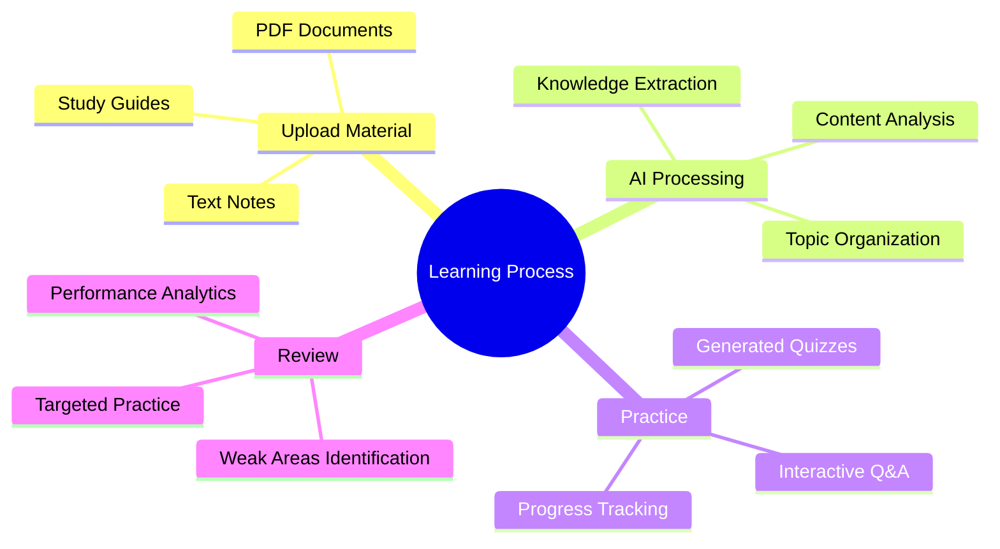

# StudyBuddy

StudyBuddy is an interactive platform designed to enhance the learning process by providing tools to upload notes, generate quizzes, manage progress, and engage in intelligent PDF-based discussions.

---

## **Features**

### 1. **Upload Notes**
- Upload learning materials in PDF, DOCX, or TXT format
- Manage uploaded files with tagging and categorization
- Support for bulk file operations
- RAG (Retrieval-Augmented Generation) integration for enhanced content processing

### 2. **Take Quiz**
- Automatically generate quizzes based on uploaded notes
- Real-time quiz-taking experience with multiple-choice questions
- Instant feedback and explanations
- Track quiz performance and progress
- LaTeX support for mathematical equations
- Improved quiz UI with visual feedback

### 3. **Progress Dashboard**
- Visualize learning trends and performance metrics
- Track quiz scores over time
- Identify weak topics for focused study
- Monitor overall learning progress
- Real-time performance analytics

### 4. **Manage Lectures**
- Organize and categorize learning materials
- Tag-based organization system
- Search and filter functionality
- Bulk operations for file management
- Export lecture data
- Vector store management for RAG

### 5. **PDF Chat**
- Interactive chat interface for discussing course content
- Context-aware responses using RAG technology
- LaTeX support for mathematical equations and formulas
- Mermaid diagram generation for visualizing concepts
- AI-powered explanations using visual aids
- Real-time rendering of mathematical notations
- Chat history export to PDF
- Multiple OpenAI model support
- Two chat modes: General and PDF-specific

---

## **How to Run the Application**

1. **Configure Environment**
   Create a `config/.env` file with your OpenAI API key:
   ```bash
   OPENAI_API_KEY=your_api_key_here
   ```

2. **Install Dependencies**
   Ensure you have Python and required libraries installed. Run:
   ```bash
   pip install -r requirements.txt
   ```

3. **Start the Application**
   Run the following command in your terminal:
   ```bash
   streamlit run src/app.py
   ```

4. **Access the Application**
   Open the provided URL in your web browser (default: `http://localhost:8501`).

---

## **Folder Structure**
```
project/
│
├── src/                 # Source code
│   ├── app.py          # Main application file
│   ├── ingestion.py    # File processing and upload logic
│   ├── quiz_generator.py # Quiz generation system
│   ├── database.py     # Progress tracking and data storage
│   └── rag.py         # RAG implementation
│
├── data/               # Application data
│   ├── lectures_db.json # Lecture metadata storage
│   ├── tags_db.json    # Tag management system
│   ├── progress.db     # Quiz and progress tracking
│   └── vector_stores  # RAG vector stores
│
├── config/             # Configuration files
│   └── .env           # Environment variables such as OPENAI_API_KEY
│
├── README.md          # Project documentation
└── requirements.txt   # Dependencies
```

---

## **Interactive Features Demonstration**

### LaTeX Equations
The assistant can render mathematical equations:
```latex
\frac{d}{dx}e^x = e^x
```

### Mermaid Diagrams
The application supports Mermaid diagrams for creating various types of visualizations:

- **Flowcharts** (`graph`) - For visualizing processes and workflows
- **Sequence Diagrams** (`sequenceDiagram`) - For showing interactions between components
- **Gantt Charts** (`gantt`) - For project timelines and schedules  
- **Pie Charts** (`pie`) - For showing proportional data
- **Entity Relationship Diagrams** (`erDiagram`) - For database schemas
- **Class Diagrams** (`classDiagram`) - For object-oriented structures
- **State Diagrams** (`stateDiagram`) - For state machines and workflows
- **Journey Diagrams** (`journey`) - For user journeys and experiences

Mermaid uses simple text-based syntax to generate these diagrams, making it easy to create and maintain visualizations directly in markdown. The diagrams are rendered automatically when viewing the chat dialouge.

#### Example Usage

Generate visual diagrams for better understanding:


This flowchart demonstrates how uploaded notes are processed and utilized for both quiz generation and AI teaching features.


This sequence diagram illustrates the interaction flow between students, the AI assistant, and the quiz system during a typical learning session.


The pie chart shows the recommended time allocation for different learning activities, with active learning taking the largest portion at 40%.


This Gantt chart outlines a typical learning timeline, showing the progression from initial material upload through practice to final review.


This mind map breaks down the key components and sub-components of the entire learning process within the system.

These diagrams showcase both our system's features and our platform's built-in visualization capabilities. Students can easily create and view these types of diagrams during their learning sessions, helping them better understand abstract concepts through visual representation.
- Sequence diagrams help visualize interaction flows and processes
- Pie charts make data distribution and proportions clear and intuitive
- Gantt charts assist in planning and tracking learning progress over time
- Mind maps break down complex topics into organized, hierarchical structures


---

## **Contributing**
If you'd like to contribute, please fork the repository and submit a pull request. For major changes, please open an issue to discuss your ideas first.

---

## **License**
This project is licensed under the MIT License. See the LICENSE file for details.
