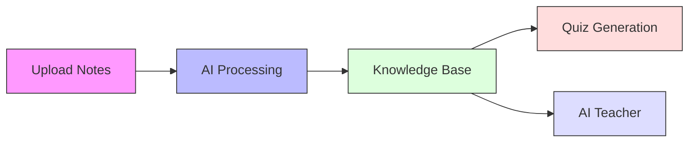
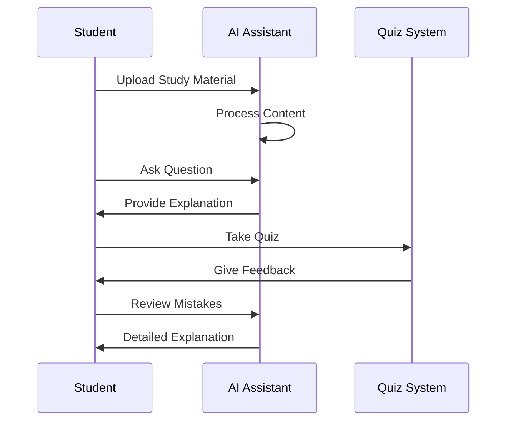
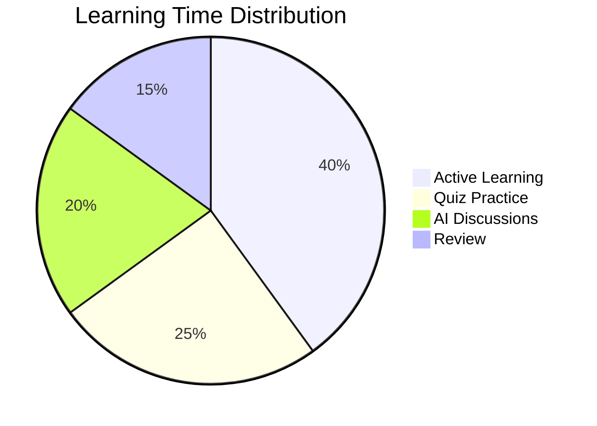
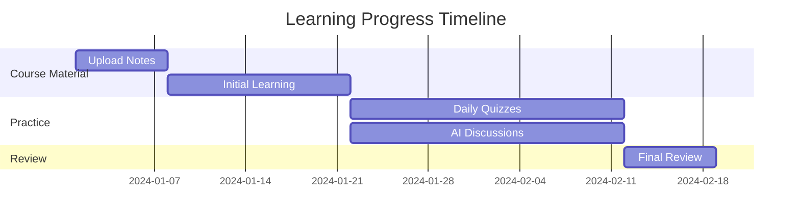
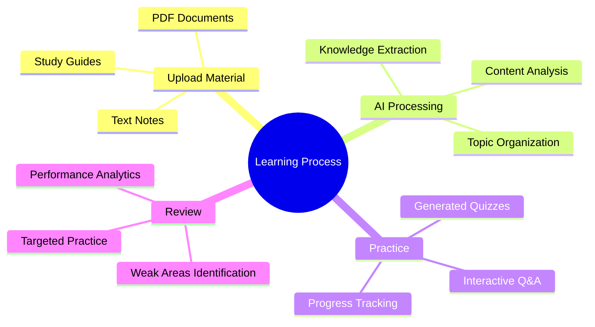

# AI Learning Assistant

The AI Learning Assistant is an interactive platform designed to enhance the learning process by providing tools to upload notes, generate quizzes, manage progress, and engage in intelligent PDF-based discussions.

---

## **Features**

### 1. **Upload Notes**
- Upload learning materials in PDF, DOCX, or TXT format
- Manage uploaded files with tagging and categorization
- Support for bulk file operations

### 2. **Take Quiz**
- Automatically generate quizzes based on uploaded notes
- Real-time quiz-taking experience with multiple-choice questions
- Instant feedback and explanations
- Track quiz performance and progress

### 3. **Progress Dashboard**
- Visualize learning trends and performance metrics
- Track quiz scores over time
- Identify weak topics for focused study
- Monitor overall learning progress

### 4. **Manage Lectures**
- Organize and categorize learning materials
- Tag-based organization system
- Search and filter functionality
- Bulk operations for file management

### 5. **AI Teacher**
- Interactive chat interface for discussing course content
- LaTeX support for mathematical equations and formulas
- Mermaid diagram generation for visualizing concepts
- AI-powered explanations using visual aids
- Real-time rendering of mathematical notations

---

## **How to Run the Application**

1. **Install Dependencies**
   Ensure you have Python and required libraries installed. Run:
   ```bash
   pip install -r requirements.txt
   ```

2. **Start the Application**
   Run the following command in your terminal:
   ```bash
   streamlit run src/app.py
   ```

3. **Access the Application**
   Open the provided URL in your web browser (default: `http://localhost:8501`).

---

## **Folder Structure**
```
project/
│
├── src/                 # Source code
│   ├── app.py          # Main application file
│   ├── ingestion.py    # File processing and upload logic
│   ├── quiz_generator.py # Quiz generation system
│   └── database.py     # Progress tracking and data storage
│
├── data/               # Application data
│   ├── lectures_db.json # Lecture metadata storage
│   ├── tags_db.json    # Tag management system
│   └──  progress.db     # Quiz and progress tracking
│
├── config/             # Configuration files
│   └── .env           # Environment variables such as OPENAI_API_KEY
│
├── README.md          # Project documentation
└── requirements.txt   # Dependencies
```

---

## **Example Usage**

### LaTeX Equations
The assistant can render mathematical equations:
```latex
\frac{d}{dx}e^x = e^x
```

### Mermaid Diagrams
Generate visual diagrams for better understanding:











These diagrams illustrate different aspects of the learning process:
- Flow diagram: Shows the basic workflow of the application
- Sequence diagram: Demonstrates student-AI interaction flow
- Pie chart: Represents optimal time distribution for effective learning
- Gantt chart: Displays a typical learning timeline
- Mind map: Breaks down the complete learning process

---

## **Contributing**
If you'd like to contribute, please fork the repository and submit a pull request. For major changes, please open an issue to discuss your ideas first.

---

## **License**
This project is licensed under the MIT License. See the LICENSE file for details.
